# 📘 EduBridge — Phân Tích UX/UI Hệ Thống

> **Tài liệu phân tích giao diện người dùng (UX/UI) cho dự án EduBridge**
> Phiên bản: 1.0 | Ngày tạo: 20/07/2026
> Mục đích: Bàn giao dự án & Nghiệm thu hợp đồng

---

## Mục Lục

1. [Tổng Quan Hệ Thống](#1-tổng-quan-hệ-thống)
2. [Vai Trò Người Dùng](#2-vai-trò-người-dùng)
3. [Sơ Đồ Trang (Sitemap)](#3-sơ-đồ-trang-sitemap)
4. [Luồng Điều Hướng (Navigation Flow)](#4-luồng-điều-hướng)
5. [Danh Sách Màn Hình & Ánh Xạ Route/Controller](#5-danh-sách-màn-hình--ánh-xạ)
6. [Chi Tiết Từng Màn Hình](#6-chi-tiết-từng-màn-hình)
7. [Luồng Tương Tác Người Dùng](#7-luồng-tương-tác-người-dùng)
8. [Thành Phần UI Dùng Chung](#8-thành-phần-ui-dùng-chung)

---

## 1. Tổng Quan Hệ Thống

### 1.1 Giới thiệu
**EduBridge** là nền tảng quản lý giáo dục toàn diện dành cho các trung tâm đào tạo. Hệ thống hỗ trợ quản lý lớp học, học sinh, giáo viên, phụ huynh, tài chính, điểm danh, bài tập, sổ điểm và nhắn tin thời gian thực.

### 1.2 Kiến trúc kỹ thuật

| Thành phần | Công nghệ |
|---|---|
| **Framework** | ASP.NET Core 8.0 (Razor Pages) |
| **Database** | SQL Server + Entity Framework Core |
| **Real-time** | SignalR (Chat Hub) |
| **Authentication** | Cookie (Web UI) + JWT Bearer (API/Mobile) |
| **CSS** | Tailwind CSS + Custom Design System |
| **Charts** | Chart.js |
| **Excel I/O** | ClosedXML |
| **API Docs** | Swagger (Swashbuckle) |

### 1.3 Cấu trúc thư mục dự án

```
EduBridge/
├── Data/                    # DbContext, cấu hình Entity Framework
├── Hubs/                    # SignalR ChatHub
├── Models/                  # 37 Entity Models
├── Pages/                   # Razor Pages (Views + Code-behind)
│   ├── AdminClasses/        #   └─ Create/Edit lớp học
│   ├── AdminParents/        #   └─ Create/Edit phụ huynh
│   ├── AdminStaff/          #   └─ Create/Edit nhân sự
│   ├── AdminStudents/       #   └─ Create/Edit học sinh
│   ├── Shared/              #   └─ Layout files
│   ├── SystemAdmin/         #   └─ Quản trị hệ thống
│   │   └── Staffs/          #       └─ Quản lý nhân sự hệ thống
│   └── Teacher/             #   └─ Trang giáo viên
├── wwwroot/
│   ├── css/                 #   └─ site.css, theme.css, teacher.css, teacher-premium.css
│   ├── js/                  #   └─ site.js, class-create.js, class-enrollment.js, ...
│   └── images/              #   └─ logo.jpg, logo.png
└── Program.cs               # Cấu hình Middleware, Auth, DI, Routing
```

---

## 2. Vai Trò Người Dùng

Hệ thống phân quyền theo 4 vai trò chính:

| Vai trò | Mã Role | Mô tả | Khu vực truy cập |
|---|---|---|---|
| **Chủ trung tâm** | `OWNER` | Quản lý toàn bộ hoạt động của trung tâm | Admin Dashboard, Classes, Courses, Students, Parents, Staff, Finance, Settings |
| **Giáo viên** | `TEACHER` | Giảng dạy, điểm danh, chấm bài, nhắn tin | Teacher Dashboard, Lectures, Attendance, Homework, Grades, Messages |
| **Phụ huynh** | `PARENT` | Theo dõi con em, nhắn tin với giáo viên | Messages, Homework (xem), Grades (xem) |
| **Quản trị viên hệ thống** | `SYSTEM_ADMIN` | Quản lý đa trung tâm, nhật ký, nhân sự hệ thống | Centers, System Staffs, Audit Logs + toàn bộ quyền Admin |

### Phân quyền Middleware (Program.cs)

```
/AdminDashboard, /AdminClasses, /AdminCourses, ...  → Policy "AdminOnly" (OWNER, SYSTEM_ADMIN)
/Teacher/*                                          → Role TEACHER
/SystemAdmin/*                                      → Role SYSTEM_ADMIN
/Messages, /Homework, /Grades, /Profile              → Authenticated (All roles)
```

---

## 3. Sơ Đồ Trang (Sitemap)

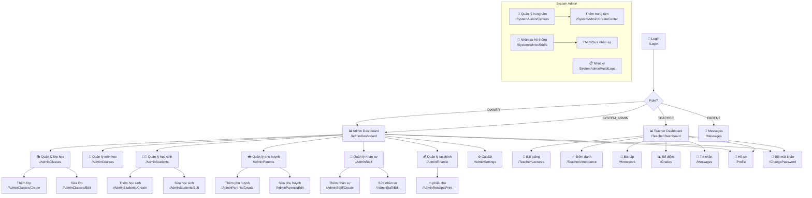
```mermaid
graph TD
    A["🔐 Login<br>/Login"] --> B{"Role?"}
    B -->|OWNER| C["📊 Admin Dashboard<br>/AdminDashboard"]
    B -->|TEACHER| D["📊 Teacher Dashboard<br>/Teacher/Dashboard"]
    B -->|PARENT| E["💬 Messages<br>/Messages"]
    B -->|SYSTEM_ADMIN| C

    C --> C1["📚 Quản lý lớp học<br>/AdminClasses"]
    C --> C2["📖 Quản lý môn học<br>/AdminCourses"]
    C --> C3["👨‍🎓 Quản lý học sinh<br>/AdminStudents"]
    C --> C4["👪 Quản lý phụ huynh<br>/AdminParents"]
    C --> C5["👥 Quản lý nhân sự<br>/AdminStaff"]
    C --> C6["💰 Quản lý tài chính<br>/AdminFinance"]
    C --> C7["⚙️ Cài đặt<br>/AdminSettings"]

    C1 --> C1a["Thêm lớp<br>/AdminClasses/Create"]
    C1 --> C1b["Sửa lớp<br>/AdminClasses/Edit"]
    C3 --> C3a["Thêm học sinh<br>/AdminStudents/Create"]
    C3 --> C3b["Sửa học sinh<br>/AdminStudents/Edit"]
    C4 --> C4a["Thêm phụ huynh<br>/AdminParents/Create"]
    C4 --> C4b["Sửa phụ huynh<br>/AdminParents/Edit"]
    C5 --> C5a["Thêm nhân sự<br>/AdminStaff/Create"]
    C5 --> C5b["Sửa nhân sự<br>/AdminStaff/Edit"]
    C6 --> C6a["In phiếu thu<br>/AdminReceiptsPrint"]

    D --> D1["📖 Bài giảng<br>/Teacher/Lectures"]
    D --> D2["✅ Điểm danh<br>/Teacher/Attendance"]
    D --> D3["📝 Bài tập<br>/Homework"]
    D --> D4["📊 Sổ điểm<br>/Grades"]
    D --> D5["💬 Tin nhắn<br>/Messages"]

    C --> CP["👤 Hồ sơ<br>/Profile"]
    C --> CW["🔑 Đổi mật khẩu<br>/ChangePassword"]
    D --> CP
    D --> CW

    subgraph SysAdmin["System Admin"]
        S1["🏢 Quản lý trung tâm<br>/SystemAdmin/Centers"]
        S2["Thêm trung tâm<br>/SystemAdmin/CreateCenter"]
        S3["👥 Nhân sự hệ thống<br>/SystemAdmin/Staffs"]
        S4["📋 Nhật ký<br>/SystemAdmin/AuditLogs"]
        S1 --> S2
        S3 --> S3a["Thêm/Sửa nhân sự"]
    end
```

---

## 4. Luồng Điều Hướng

### 4.1 Layout: Admin (_AdminLayout.cshtml)
Áp dụng cho: **OWNER**, **SYSTEM_ADMIN**

| Icon | Menu Item | Route | Mô tả |
|---|---|---|---|
| 📊 | Dashboard | `/AdminDashboard` | Tổng quan hoạt động |
| 📚 | Lớp học | `/AdminClasses` | Quản lý lớp, phòng, ca |
| 📖 | Môn học | `/AdminCourses` | Quản lý môn học |
| 👨‍🎓 | Học sinh | `/AdminStudents` | Quản lý học sinh |
| 👪 | Phụ huynh | `/AdminParents` | Quản lý phụ huynh |
| 👥 | Nhân sự | `/AdminStaff` | Quản lý giáo viên, nhân viên |
| 💰 | Tài chính | `/AdminFinance` | Hóa đơn, thu phí |
| ⚙️ | Cài đặt | `/AdminSettings` | Cấu hình trung tâm |

**Menu bổ sung cho SYSTEM_ADMIN:**

| Icon | Menu Item | Route |
|---|---|---|
| 🏢 | Trung tâm | `/SystemAdmin/Centers` |
| 👥 | Nhân sự HT | `/SystemAdmin/Staffs` |
| 📋 | Nhật ký | `/SystemAdmin/AuditLogs` |

**Header:** Hamburger toggle, Dropdown thông báo, User dropdown (Hồ sơ, Đổi mật khẩu, Chuyển vai trò, Đăng xuất).

### 4.2 Layout: Teacher (_TeacherLayout.cshtml)
Áp dụng cho: **TEACHER**

| Icon | Menu Item | Route |
|---|---|---|
| 📊 | Dashboard | `/Teacher/Dashboard` |
| 📖 | Bài giảng | `/Teacher/Lectures` |
| 📝 | Bài tập | `/Homework` |
| 📊 | Sổ điểm | `/Grades` |
| ✅ | Điểm danh | `/Teacher/Attendance` |
| 💬 | Tin nhắn | `/Messages` |

**Header:** Tương tự Admin layout. Hỗ trợ chuyển vai trò sang OWNER nếu có quyền.

### 4.3 Layout: Parent (_Layout.cshtml)
Áp dụng cho: **PARENT** (giao diện mobile-first)

**Bottom Navigation Bar:**

| Icon | Menu Item | Route |
|---|---|---|
| 🏠 | Trang chủ | `/Dashboard` |
| 📝 | Bài tập | `/Homework` |
| 📈 | Tiến độ | `/Progress` |
| 📊 | Sổ điểm | `/Grades` |

> [!NOTE]
> Trang `/Dashboard` và `/Progress` không tồn tại trong source code hiện tại. Bottom nav hiển thị nhưng các route này chưa được implement.

---

## 5. Danh Sách Màn Hình & Ánh Xạ

### 5.1 Bảng ánh xạ tổng hợp

| # | Tên màn hình | Route | Razor Page (Controller) | Layout | Vai trò |
|---|---|---|---|---|---|
| 1 | Đăng nhập | `/Login` | `Pages/Login.cshtml` | None | Public |
| 2 | Trang chủ (Redirect) | `/` | `Pages/Index.cshtml` | None | Public |
| 3 | Admin Dashboard | `/AdminDashboard` | `Pages/AdminDashboard.cshtml` | `_AdminLayout` | OWNER, SYSTEM_ADMIN |
| 4 | Quản lý lớp học | `/AdminClasses` | `Pages/AdminClasses.cshtml` | `_AdminLayout` | OWNER, SYSTEM_ADMIN |
| 5 | Thêm lớp học | `/AdminClasses/Create` | `Pages/AdminClasses/Create.cshtml` | `_AdminLayout` | OWNER, SYSTEM_ADMIN |
| 6 | Sửa lớp học | `/AdminClasses/Edit` | `Pages/AdminClasses/Edit.cshtml` | `_AdminLayout` | OWNER, SYSTEM_ADMIN |
| 7 | Quản lý môn học | `/AdminCourses` | `Pages/AdminCourses.cshtml` | `_AdminLayout` | OWNER, SYSTEM_ADMIN |
| 8 | Quản lý học sinh | `/AdminStudents` | `Pages/AdminStudents.cshtml` | `_AdminLayout` | OWNER, SYSTEM_ADMIN |
| 9 | Thêm học sinh | `/AdminStudents/Create` | `Pages/AdminStudents/Create.cshtml` | `_AdminLayout` | OWNER, SYSTEM_ADMIN |
| 10 | Sửa học sinh | `/AdminStudents/Edit` | `Pages/AdminStudents/Edit.cshtml` | `_AdminLayout` | OWNER, SYSTEM_ADMIN |
| 11 | Quản lý phụ huynh | `/AdminParents` | `Pages/AdminParents.cshtml` | `_AdminLayout` | OWNER, SYSTEM_ADMIN |
| 12 | Thêm phụ huynh | `/AdminParents/Create` | `Pages/AdminParents/Create.cshtml` | `_AdminLayout` | OWNER, SYSTEM_ADMIN |
| 13 | Sửa phụ huynh | `/AdminParents/Edit` | `Pages/AdminParents/Edit.cshtml` | `_AdminLayout` | OWNER, SYSTEM_ADMIN |
| 14 | Quản lý nhân sự | `/AdminStaff` | `Pages/AdminStaff.cshtml` | `_AdminLayout` | OWNER, SYSTEM_ADMIN |
| 15 | Thêm nhân sự | `/AdminStaff/Create` | `Pages/AdminStaff/Create.cshtml` | `_AdminLayout` | OWNER, SYSTEM_ADMIN |
| 16 | Sửa nhân sự | `/AdminStaff/Edit` | `Pages/AdminStaff/Edit.cshtml` | `_AdminLayout` | OWNER, SYSTEM_ADMIN |
| 17 | Quản lý tài chính | `/AdminFinance` | `Pages/AdminFinance.cshtml` | `_AdminLayout` | OWNER, SYSTEM_ADMIN |
| 18 | In phiếu thu | `/AdminReceiptsPrint` | `Pages/AdminReceiptsPrint.cshtml` | None (Standalone) | OWNER, SYSTEM_ADMIN |
| 19 | Cài đặt hệ thống | `/AdminSettings` | `Pages/AdminSettings.cshtml` | `_AdminLayout` | OWNER, SYSTEM_ADMIN |
| 20 | Teacher Dashboard | `/Teacher/Dashboard` | `Pages/Teacher/Dashboard.cshtml` | `_TeacherLayout` | TEACHER |
| 21 | Quản lý bài giảng | `/Teacher/Lectures` | `Pages/Teacher/Lectures.cshtml` | `_TeacherLayout` | TEACHER |
| 22 | Quản lý điểm danh | `/Teacher/Attendance` | `Pages/Teacher/Attendance.cshtml` | `_TeacherLayout` | TEACHER |
| 23 | Bài tập | `/Homework` | `Pages/Homework.cshtml` | `_TeacherLayout` / `_Layout` | TEACHER, PARENT |
| 24 | Sổ điểm | `/Grades` | `Pages/Grades.cshtml` | `_TeacherLayout` / `_Layout` | TEACHER, PARENT |
| 25 | Tin nhắn | `/Messages` | `Pages/Messages.cshtml` | `_TeacherLayout` / `_Layout` | TEACHER, PARENT |
| 26 | Hồ sơ cá nhân | `/Profile` | `Pages/Profile.cshtml` | Dynamic | All |
| 27 | Đổi mật khẩu | `/ChangePassword` | `Pages/ChangePassword.cshtml` | Dynamic | All |
| 28 | Quản lý trung tâm | `/SystemAdmin/Centers` | `Pages/SystemAdmin/Centers.cshtml` | `_AdminLayout` | SYSTEM_ADMIN |
| 29 | Thêm trung tâm | `/SystemAdmin/CreateCenter` | `Pages/SystemAdmin/CreateCenter.cshtml` | `_AdminLayout` | SYSTEM_ADMIN |
| 30 | Nhân sự hệ thống | `/SystemAdmin/Staffs` | `Pages/SystemAdmin/Staffs/Index.cshtml` | `_AdminLayout` | SYSTEM_ADMIN |
| 31 | Thêm nhân sự HT | `/SystemAdmin/Staffs/Create` | `Pages/SystemAdmin/Staffs/Create.cshtml` | `_AdminLayout` | SYSTEM_ADMIN |
| 32 | Sửa nhân sự HT | `/SystemAdmin/Staffs/Edit` | `Pages/SystemAdmin/Staffs/Edit.cshtml` | `_AdminLayout` | SYSTEM_ADMIN |
| 33 | Nhật ký hệ thống | `/SystemAdmin/AuditLogs` | `Pages/SystemAdmin/AuditLogs.cshtml` | `_AdminLayout` | SYSTEM_ADMIN |

**Tổng cộng: 33 màn hình**

---

## 6. Chi Tiết Từng Màn Hình

---

### 6.1 Đăng nhập (`/Login`)

**Razor Page:** [Login.cshtml](file:///d:/Demo/EduBridge/EduBridge/Pages/Login.cshtml)

| Thuộc tính | Giá trị |
|---|---|
| **Layout** | None (Standalone) |
| **Tiêu đề** | "EduBridge" — "Nền tảng quản lý giáo dục toàn diện" |
| **Mô tả** | Trang đăng nhập chính cho tất cả vai trò |

**Thành phần UI:**

| # | Thành phần | Loại | Chi tiết |
|---|---|---|---|
| 1 | Logo & Tiêu đề | Text | "EduBridge", subtitle "Nền tảng quản lý giáo dục toàn diện" |
| 2 | Email/SĐT | `<input type="text">` | Placeholder: "Email hoặc số điện thoại", required |
| 3 | Mật khẩu | `<input type="password">` | Placeholder: "Nhập mật khẩu", required, có toggle icon 👁️ |
| 4 | Nút đăng nhập | `<button type="submit">` | Text: "Đăng nhập" |
| 5 | Ghi chú | Text | "Sử dụng email hoặc số điện thoại của tài khoản đã được cấp" |
| 6 | Toast thông báo | Toast | Hiển thị "Thành công" / "Thất bại" sau khi submit |


---

### 6.2 Trang chủ — Redirect (`/`)

**Razor Page:** [Index.cshtml](file:///d:/Demo/EduBridge/EduBridge/Pages/Index.cshtml) + [Index.cshtml.cs](file:///d:/Demo/EduBridge/EduBridge/Pages/Index.cshtml.cs)

**Logic điều hướng (OnGet):**

| Điều kiện | Redirect tới |
|---|---|
| Chưa đăng nhập | `/Login` |
| Role = `OWNER` | `/AdminDashboard` |
| Role = `TEACHER` | `/Teacher/Dashboard` |
| Role = `PARENT` | `/Messages` |
| Khác | `/Login` |

**Giao diện (Index.cshtml):** Trang demo login với 2 nút chuyển đổi vai trò ("Chủ trung tâm" / "Giáo viên") và form giả lập đăng nhập.

---

### 6.3 Admin Dashboard (`/AdminDashboard`)

**Razor Page:** [AdminDashboard.cshtml](file:///d:/Demo/EduBridge/EduBridge/Pages/AdminDashboard.cshtml)

| Thuộc tính | Giá trị |
|---|---|
| **Layout** | `_AdminLayout` |
| **Tiêu đề** | "Dashboard" — "Tổng quan hoạt động trung tâm" |
| **Service** | `IDashboardService` |

**Thành phần UI:**

#### Stat Cards (4 thẻ thống kê)

| # | Tên thẻ | Dữ liệu | Định dạng |
|---|---|---|---|
| 1 | Tổng số học sinh | `TotalStudents` | Số nguyên + `StudentChangeText` |
| 2 | Số lớp đang hoạt động | `ActiveClasses` | Số nguyên + `ClassChangeText` |
| 3 | Doanh thu tháng này | `MonthlyRevenue` | X VNĐ + `RevenueChangeText` |
| 4 | Tỷ lệ chuyên cần | `WeeklyAttendanceRate` | X% + `AttendanceChangeText` |

#### Charts (2 biểu đồ — Chart.js)

| # | Tên biểu đồ | Loại | Dữ liệu |
|---|---|---|---|
| 1 | Doanh thu 6 tháng gần nhất | Line chart | Doanh thu theo tháng |
| 2 | Tình hình điểm danh tuần này | Bar chart | "Có mặt" vs "Vắng mặt" |

#### Widgets

| # | Widget | Nội dung |
|---|---|---|
| 1 | Lớp học mới nhất | Danh sách: ClassName, TeacherName, TotalStudents |
| 2 | Thông báo quan trọng | Danh sách: Title, Content |

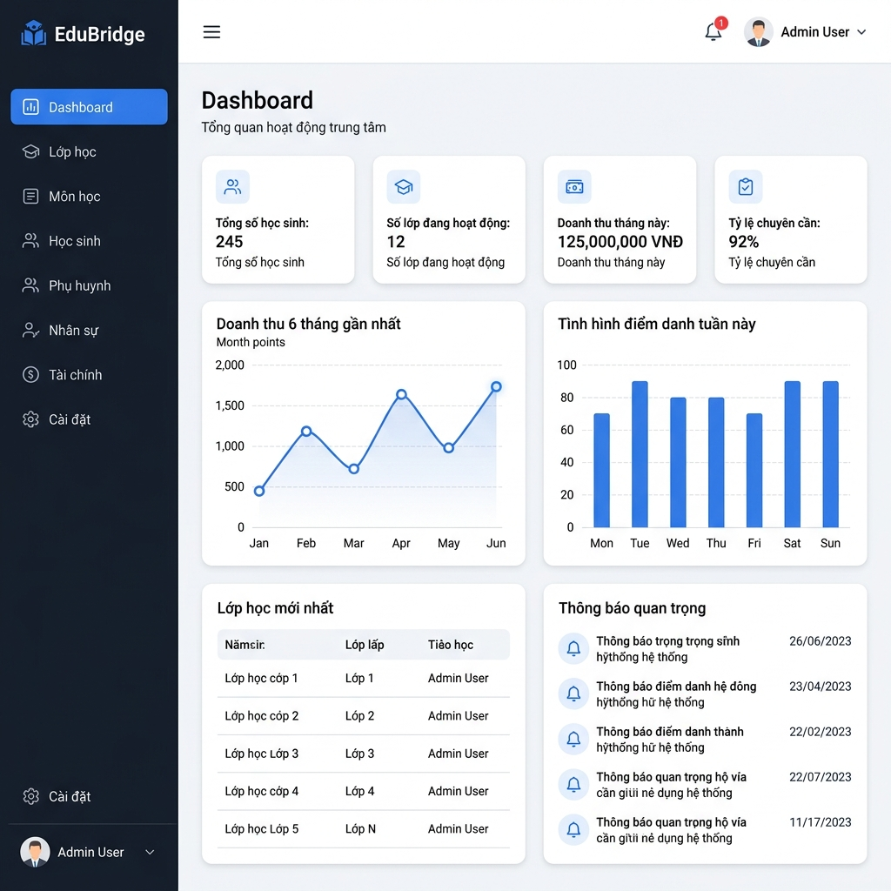

---

### 6.4 Quản lý lớp học (`/AdminClasses`)

**Razor Page:** [AdminClasses.cshtml](file:///d:/Demo/EduBridge/EduBridge/Pages/AdminClasses.cshtml)

| Thuộc tính | Giá trị |
|---|---|
| **Layout** | `_AdminLayout` |
| **Tiêu đề** | "Quản lý lớp học" — "Quản lý thông tin các lớp học" |
| **Services** | `IClassManagementService`, `IRoomManagementService` |

> [!IMPORTANT]
> Trang này chứa **3 tab** quản lý riêng biệt trong cùng một trang.

#### Tab 1: Danh sách lớp học

**Bộ lọc:**

| # | Tên filter | Loại input | Giá trị mặc định |
|---|---|---|---|
| 1 | Tìm tên/mã lớp | Text | — |
| 2 | Tên giáo viên | Text | — |
| 3 | Môn học | Searchable Dropdown | "Tất cả môn học" |
| 4 | Phòng học | Searchable Dropdown | "Tất cả phòng học" |
| 5 | Trạng thái | Dropdown | Tất cả / Đang hoạt động / Tạm dừng / Đã đóng |
| 6 | Ngày khai giảng | Date Picker | — |
| 7 | Ngày kết thúc | Date Picker | — |

**Nút hành động:** `+ Thêm lớp mới` (→ `/AdminClasses/Create`), `Làm mới bộ lọc`, `Tìm kiếm`

**Bảng dữ liệu:**

| STT | ID | Mã lớp | Tên lớp | Môn học | Giáo viên | Sĩ số | Lịch học | Thời gian học | Phòng | Trạng thái | Thao tác |
|---|---|---|---|---|---|---|---|---|---|---|---|
| 1 | ... | ... | ... | ... | ... | X/Y | T2,T4,T6 | 08:00-09:30 | P101 | Badge | Xem/Sửa, Đóng lớp, Xóa |

**Modal dialogs:**
- **Đóng lớp học:** Xác nhận đóng lớp (Hủy / Đóng lớp)
- **Xóa lớp học:** Xác nhận xóa (Hủy / Xóa)

**Phân trang:** `« ‹ 1 2 3 › »` + Page Size selector (10, 20, 50)

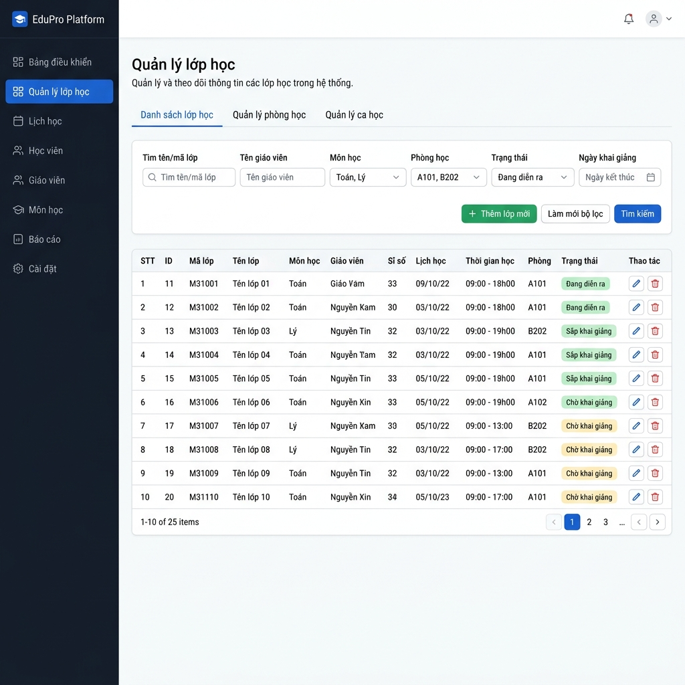

---

#### Tab 2: Quản lý phòng học

**Bộ lọc:** `Tìm mã phòng, tên phòng` (text), `Trạng thái` (dropdown)

**Nút hành động:** `+ Thêm phòng học`, `Làm mới bộ lọc`, `Tìm kiếm`

**Bảng dữ liệu:**

| STT | ID | Mã phòng | Tên phòng | Sức chứa | Vị trí | Số lớp | Lịch sử dụng | Trạng thái | Thao tác |
|---|---|---|---|---|---|---|---|---|---|

**Modal Thêm/Sửa phòng học:**

| # | Trường | Loại | Bắt buộc |
|---|---|---|---|
| 1 | Mã phòng | Text | ✅ |
| 2 | Tên phòng | Text | ✅ |
| 3 | Sức chứa | Number | — |
| 4 | Tầng | Text | — |
| 5 | Trạng thái | Select | — |

---

#### Tab 3: Quản lý ca học

**Bộ lọc:** `Tìm mã ca, tên ca` (text), `Trạng thái` (dropdown)

**Nút hành động:** `+ Thêm ca học`, `Làm mới bộ lọc`, `Tìm kiếm`

**Bảng dữ liệu:**

| STT | ID | Mã ca | Tên ca | Giờ bắt đầu | Giờ kết thúc | Số lớp đang dùng | Trạng thái | Thao tác |
|---|---|---|---|---|---|---|---|---|

**Modal Thêm/Sửa ca học:**

| # | Trường | Loại | Bắt buộc |
|---|---|---|---|
| 1 | Mã ca | Text | ✅ |
| 2 | Tên ca | Text | ✅ |
| 3 | Giờ bắt đầu | Time | ✅ |
| 4 | Giờ kết thúc | Time | ✅ |
| 5 | Trạng thái | Toggle | ✅ |
| 6 | Ghi chú | Textarea | — |

---

### 6.5 Thêm lớp học (`/AdminClasses/Create`)

**Razor Page:** [Create.cshtml](file:///d:/Demo/EduBridge/EduBridge/Pages/AdminClasses/Create.cshtml)

| Thuộc tính | Giá trị |
|---|---|
| **Layout** | `_AdminLayout` |
| **Tiêu đề** | "Thêm lớp học" — "Thông tin lớp học" |

**Form chính:**

| # | Trường | Loại | Bắt buộc | Ghi chú |
|---|---|---|---|---|
| 1 | Mã lớp | Text (readonly) | — | Tự động gợi ý |
| 2 | Tên lớp | Text | ✅ | |
| 3 | Môn học | Searchable Dropdown | ✅ | |
| 4 | Tổng số buổi | Number | ✅ | |
| 5 | Giáo viên | Searchable Dropdown | ✅ | |
| 6 | Phòng học | Searchable Dropdown | ✅ | |
| 7 | Ngày khai giảng | Date Picker | ✅ | |
| 8 | Ngày kết thúc dự kiến | Text (readonly) | — | Tự tính từ tổng buổi + lịch học |

**Section Lịch học:**
- Nút `+ Thêm lịch` → Thêm dòng mới
- Mỗi dòng: `Thứ` (dropdown), `Ca học gợi ý` (dropdown), `Giờ bắt đầu` (time), `Giờ kết thúc` (time), `Xóa` (button)
- JS tự động cập nhật ngày kết thúc khi thay đổi lịch (file: `class-create.js`)

**Nút:** `Hủy` (quay lại), `Lưu lớp học` (submit)

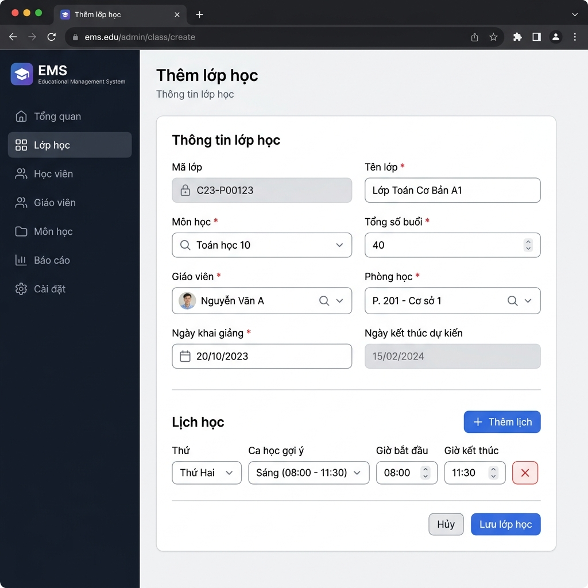

---

### 6.6 Sửa lớp học (`/AdminClasses/Edit`)

**Razor Page:** [Edit.cshtml](file:///d:/Demo/EduBridge/EduBridge/Pages/AdminClasses/Edit.cshtml)

Giao diện tương tự `Create.cshtml`, bổ sung:
- Dữ liệu lớp được load sẵn vào form
- Section **Danh sách học viên** với chức năng tìm kiếm và ghi danh (file: `class-enrollment.js`)
- Modal tìm kiếm học viên: Gọi API `/api/AvailableStudents`, chọn checkbox, POST `EnrollStudents`
- Nút `Xóa học viên` khỏi lớp: POST `RemoveStudent`

---

### 6.7 Quản lý môn học (`/AdminCourses`)

**Razor Page:** [AdminCourses.cshtml](file:///d:/Demo/EduBridge/EduBridge/Pages/AdminCourses.cshtml)

| Thuộc tính | Giá trị |
|---|---|
| **Layout** | `_AdminLayout` |
| **Tiêu đề** | "Quản lý môn học" — "Quản lý danh sách môn học của trung tâm" |

**Bộ lọc:**

| # | Tên filter | Loại | Giá trị mặc định |
|---|---|---|---|
| 1 | Tìm mã môn, tên môn | Text | — |
| 2 | Trạng thái | Dropdown | Tất cả / Đang sử dụng / Tạm dừng |

**Nút:** `+ Thêm môn học`, `Làm mới bộ lọc`, `Tìm kiếm`

**Bảng dữ liệu:**

| STT | ID | Mã môn | Tên môn | Thời lượng | Học phí | Trạng thái | Thao tác |
|---|---|---|---|---|---|---|---|

- **Trạng thái**: Toggle button (submit form inline)
- **Thao tác**: Xem/Sửa (mở modal), Xóa

**Modal Thêm/Sửa môn học:**

| # | Trường | Loại | Bắt buộc |
|---|---|---|---|
| 1 | Mã môn | Text | ✅ |
| 2 | Tên môn | Text | ✅ |
| 3 | Tổng số buổi | Number | — |
| 4 | Học phí | Number | — |
| 5 | Mô tả | Textarea | — |
| 6 | Trạng thái | Toggle | — |

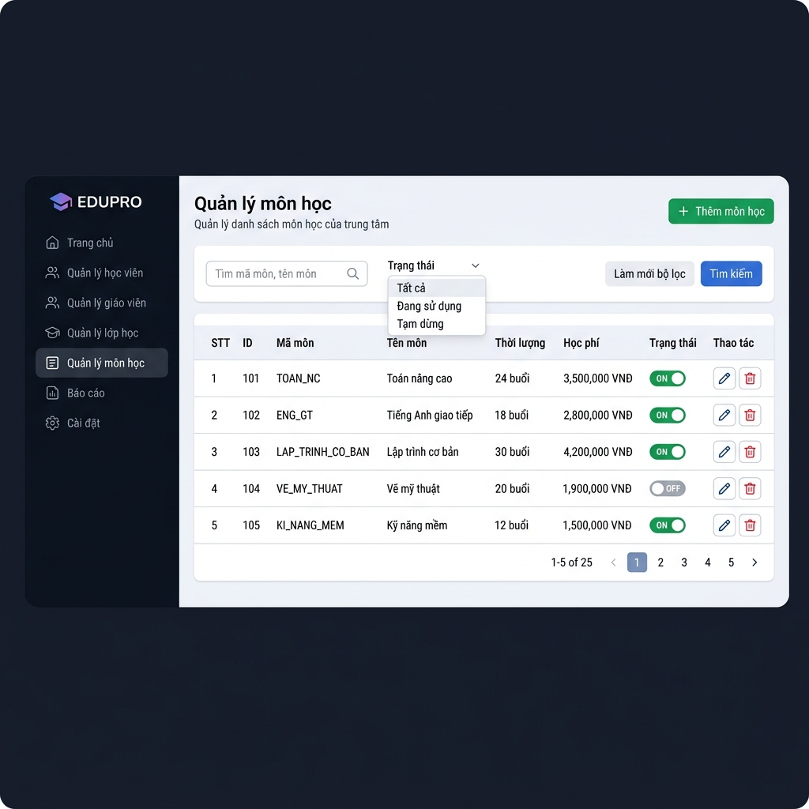

---

### 6.8 Quản lý học sinh (`/AdminStudents`)

**Razor Page:** [AdminStudents.cshtml](file:///d:/Demo/EduBridge/EduBridge/Pages/AdminStudents.cshtml)

| Thuộc tính | Giá trị |
|---|---|
| **Layout** | `_AdminLayout` |
| **Tiêu đề** | "Quản lý học sinh" — "Quản lý thông tin học sinh và phụ huynh" |

**Bộ lọc:**

| # | Tên filter | Loại | Giá trị |
|---|---|---|---|
| 1 | Tìm mã, tên học sinh | Text | — |
| 2 | Tìm tên phụ huynh | Text | — |
| 3 | Tìm SĐT/email HS, PH | Text | — |
| 4 | Giới tính | Dropdown | Tất cả / Nam / Nữ |
| 5 | Lớp | Dropdown | Tất cả + danh sách lớp |
| 6 | Trạng thái | Dropdown | Tất cả / Đang hoạt động / Ngừng hoạt động |

**Nút hành động:** `+ Thêm mới`, `Import`, `Export`, `Lịch sử Import/Export`, `Làm mới bộ lọc`, `Tìm kiếm`

**Bảng dữ liệu:**

| STT | ID | Học sinh | Liên hệ | Ngày sinh | Giới tính | Phụ huynh | Lớp hiện tại | Trạng thái | Thao tác |
|---|---|---|---|---|---|---|---|---|---|

- **Học sinh**: Avatar/Initials + Tên + Mã HS
- **Trạng thái**: Toggle button
- **Thao tác**: Xem/Sửa (→ Edit), Xóa

**Modal Import:** Upload file Excel, `Bỏ chọn file`, `Tải file mẫu`, `Import`

**Modal Lịch sử Import/Export:** Bảng: STT, Tiêu đề, Người thao tác, Hành động, File nhập liệu, File kết quả, Trạng thái, Thông báo lỗi

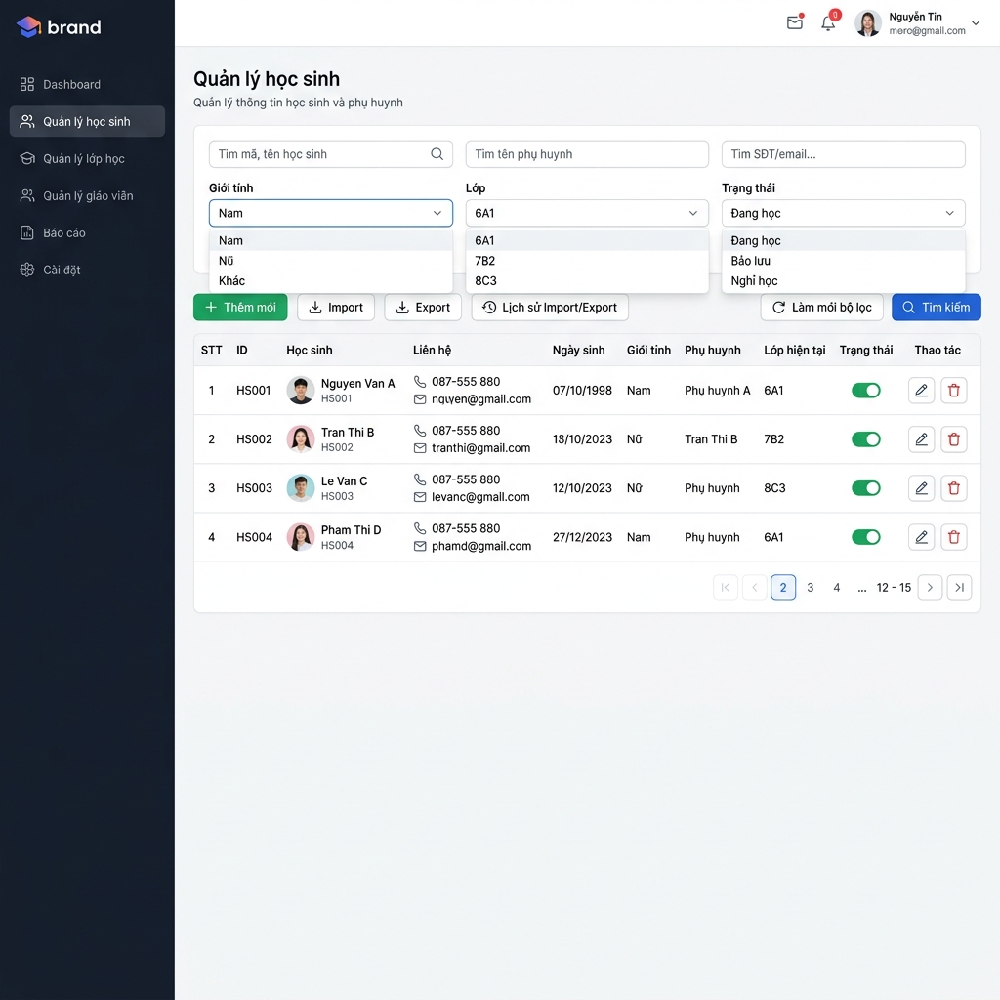

---

### 6.9 Thêm / Sửa học sinh (`/AdminStudents/Create`, `/AdminStudents/Edit`)

**Razor Page:** [Create.cshtml](file:///d:/Demo/EduBridge/EduBridge/Pages/AdminStudents/Create.cshtml), [Edit.cshtml](file:///d:/Demo/EduBridge/EduBridge/Pages/AdminStudents/Edit.cshtml)

**Section 1 — Thông tin cá nhân:**

| # | Trường | Loại | Bắt buộc |
|---|---|---|---|
| 1 | Avatar | File Upload (preview) | — |
| 2 | Mã học sinh | Text | ✅ |
| 3 | Tên học sinh | Text | ✅ |
| 4 | Ngày sinh | Date Picker (custom) | ✅ |
| 5 | Giới tính | Radio (Nam / Nữ) | — |
| 6 | Dân tộc | Text | — |
| 7 | Tôn giáo | Text | — |
| 8 | Số CMND/CCCD | Text | — |
| 9 | Ngày cấp | Date Picker | — |
| 10 | Nơi cấp | Text | — |
| 11 | Trạng thái | Toggle (chỉ Edit) | — |

**Section 2 — Thông tin liên lạc:**

| # | Trường | Loại |
|---|---|---|
| 1 | Địa chỉ hiện tại | Text |
| 2 | Địa chỉ thường trú | Text |
| 3 | Nguyên quán | Text |
| 4 | Nơi sinh | Text |
| 5 | Số điện thoại | Text |
| 6 | Email cá nhân | Text |

**Section 3 — Thông tin phụ huynh:**
- Input kiểm tra tài khoản PH (SĐT/Email) → Nút `Kiểm tra` → Kết quả danh sách PH → Chọn
- Hoặc nút `Tạo mới` → Form nhập: Tên PH (*), SĐT PH (*), Email PH

**Nút:** `Hủy`, `Lưu học sinh`

---

### 6.10 Quản lý phụ huynh (`/AdminParents`)

**Razor Page:** [AdminParents.cshtml](file:///d:/Demo/EduBridge/EduBridge/Pages/AdminParents.cshtml)

| Thuộc tính | Giá trị |
|---|---|
| **Layout** | `_AdminLayout` |
| **Tiêu đề** | "Quản lý phụ huynh" |

**Bộ lọc:**

| # | Tên filter | Loại | Giá trị |
|---|---|---|---|
| 1 | Tên phụ huynh | Text | — |
| 2 | Email | Text | — |
| 3 | Số điện thoại | Text | — |
| 4 | Trạng thái | Dropdown | Tất cả / Đang hoạt động / Tạm dừng |
| 5 | Liên kết học sinh | Dropdown | Tất cả / Có học sinh / Chưa có học sinh |

**Nút:** `+ Thêm mới`, `Import`, `Export`, `Lịch sử Import/Export`, `Làm mới bộ lọc`, `Tìm kiếm`

**Bảng dữ liệu:**

| STT | ID | Phụ huynh | Email | SĐT | Học sinh liên kết | Ngày tạo | Trạng thái tại TT | Thao tác |
|---|---|---|---|---|---|---|---|---|

- **Thao tác**: Xem/Sửa, Cấp lại MK, Xóa

**Modals:** Reset mật khẩu (xác nhận → hiển thị MK tạm), Xóa phụ huynh, Import Excel, Lịch sử Import/Export


---

### 6.11 Thêm / Sửa phụ huynh (`/AdminParents/Create`, `/AdminParents/Edit`)

**Razor Page:** [Create.cshtml](file:///d:/Demo/EduBridge/EduBridge/Pages/AdminParents/Create.cshtml) (dùng partial `_ParentForm.cshtml`)

**Form (qua _ParentForm.cshtml):**

| # | Trường | Loại | Bắt buộc |
|---|---|---|---|
| 1 | Họ và tên | Text | ✅ |
| 2 | Số điện thoại | Text | ✅ |
| 3 | Email | Text | — |
| 4 | Ngày sinh | Date Picker | — |
| 5 | Giới tính | Radio (Nam / Nữ) | — |
| 6 | Dân tộc | Text | — |
| 7 | Tôn giáo | Text | — |
| 8 | CMND/CCCD | Text | — |
| 9 | Ngày cấp | Date Picker | — |
| 10 | Nơi cấp | Text | — |
| 11 | Địa chỉ hiện tại | Text | — |
| 12 | Địa chỉ thường trú | Text | — |
| 13 | Nguyên quán | Text | — |
| 14 | Nơi sinh | Text | — |
| 15 | Trạng thái tại TT | Toggle (Active/Inactive) | — |

**Nút:** `Hủy`, `Lưu phụ huynh`

---

### 6.12 Quản lý nhân sự (`/AdminStaff`)

**Razor Page:** [AdminStaff.cshtml](file:///d:/Demo/EduBridge/EduBridge/Pages/AdminStaff.cshtml)

| Thuộc tính | Giá trị |
|---|---|
| **Layout** | `_AdminLayout` |
| **Tiêu đề** | "Quản lý nhân sự" |

**Bộ lọc:**

| # | Tên filter | Loại | Giá trị |
|---|---|---|---|
| 1 | Tìm kiếm (mã, tên) | Text | — |
| 2 | Liên hệ (email, SĐT) | Text | — |
| 3 | Vai trò | Dropdown | Giáo viên / Chủ TT |
| 4 | Trạng thái | Dropdown | Hoạt động / Đã khóa |

**Nút:** `+ Thêm mới`, `Import`, `Export`, `Lịch sử Import/Export`, `Làm mới bộ lọc`, `Tìm kiếm`

**Bảng dữ liệu:**

| STT | ID | Nhân sự | Liên hệ | Chuyên môn | Lớp phụ trách | Trạng thái | Thao tác |
|---|---|---|---|---|---|---|---|

- **Nhân sự**: Avatar + Tên + Vai trò badges + Mã NV
- **Trạng thái**: Toggle button
- **Thao tác**: Sửa, Xóa, Cấp lại MK

**Modals:** Reset mật khẩu, Xóa nhân sự, Import Excel, Lịch sử Import/Export


---

### 6.13 Thêm / Sửa nhân sự (`/AdminStaff/Create`, `/AdminStaff/Edit`)

**Razor Page:** [Create.cshtml](file:///d:/Demo/EduBridge/EduBridge/Pages/AdminStaff/Create.cshtml)

**Section 1 — Thông tin cá nhân:**

| # | Trường | Loại | Bắt buộc |
|---|---|---|---|
| 1 | Avatar | File Upload (preview + clear) | — |
| 2 | Mã nhân sự | Text | ✅ |
| 3 | Họ và tên | Text | ✅ |
| 4 | Ngày sinh | Date Picker (custom) | ✅ |
| 5 | Giới tính | Radio (Nam / Nữ) | ✅ |
| 6 | Dân tộc | Text | — |
| 7 | Tôn giáo | Text | — |
| 8 | Số CMND/CCCD | Text | ✅ |
| 9 | Ngày cấp CCCD | Date Picker | — |
| 10 | Nơi cấp | Text | — |
| 11 | Trạng thái | Toggle (Active/Inactive) | — |

**Section 2 — Thông tin liên lạc:** Địa chỉ hiện tại, Địa chỉ thường trú, Nguyên quán, Nơi sinh, SĐT (*), Email

**Nút:** `Hủy`, `Lưu`

---

### 6.14 Quản lý tài chính (`/AdminFinance`)

**Razor Page:** [AdminFinance.cshtml](file:///d:/Demo/EduBridge/EduBridge/Pages/AdminFinance.cshtml)

| Thuộc tính | Giá trị |
|---|---|
| **Layout** | `_AdminLayout` |
| **Tiêu đề** | "Quản lý tài chính" — "Theo dõi doanh thu, công nợ và đóng tiền học của học sinh" |

**Stat Cards (4 thẻ):**

| # | Tên thẻ | Dữ liệu |
|---|---|---|
| 1 | Tổng doanh thu dự kiến | Tổng giá trị hóa đơn |
| 2 | Thực thu (Đã đóng) | Tổng đã thanh toán |
| 3 | Còn lại (Công nợ) | Tổng còn nợ |
| 4 | Học sinh nợ phí | Số lượng HS chưa đóng đủ |

**Bộ lọc:**

| # | Tên filter | Loại | Giá trị |
|---|---|---|---|
| 1 | Mã hóa đơn | Text | — |
| 2 | Tên/mã học sinh | Text | — |
| 3 | Lớp học | Dropdown | Tất cả |
| 4 | Trạng thái | Dropdown | Tất cả / Chưa TT / TT 1 phần / Đã TT đủ / Đã hủy |
| 5 | Từ ngày | Date Picker | — |
| 6 | Đến ngày | Date Picker | — |

**Nút:** `Làm mới bộ lọc`, `Tìm kiếm`

**Bảng dữ liệu:**

| STT | ID | Mã HĐ | Học sinh | Lớp học | Số tiền | Đã thanh toán | Còn nợ | Trạng thái | Thời gian | Thao tác |
|---|---|---|---|---|---|---|---|---|---|---|

- **Trạng thái**: Badge màu (Chưa TT = đỏ, TT 1 phần = vàng, Đã TT đủ = xanh, Đã hủy = xám)
- **Thao tác**: `Thu tiền` (mở modal), `Biên lai` (→ `/AdminReceiptsPrint`)

**Modal Thu học phí (`paymentModal`):**

| # | Trường | Loại |
|---|---|---|
| 1 | Học sinh (hiển thị) | Text (readonly) |
| 2 | Số tiền (VNĐ) | Number |
| 3 | Phương thức thanh toán | Select (Tiền mặt / Chuyển khoản) |
| 4 | Mã giao dịch (Nếu CK) | Text |

- API: POST `/api/v1/owner/payments`
- Nút: `Hủy`, `Xác nhận thu`

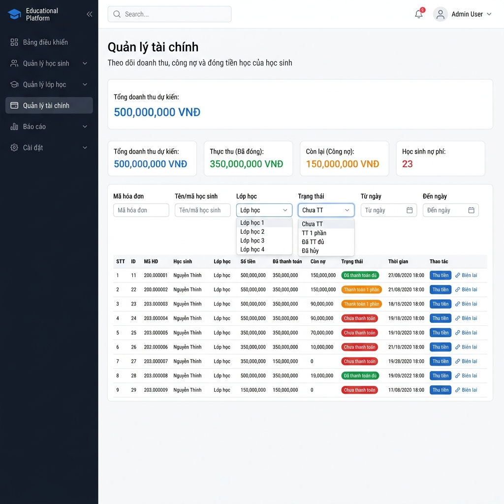

---

### 6.15 In phiếu thu (`/AdminReceiptsPrint`)

**Razor Page:** [AdminReceiptsPrint.cshtml](file:///d:/Demo/EduBridge/EduBridge/Pages/AdminReceiptsPrint.cshtml)

| Thuộc tính | Giá trị |
|---|---|
| **Layout** | None (Standalone, tối ưu cho in A4) |
| **Tiêu đề** | "Phiếu Thu Tiền" |

**Cấu trúc phiếu thu:**

```
┌──────────────────────────────────────────────────┐
│ [Tên Trung Tâm]              Mẫu số: 01-TT      │
│ Địa chỉ: ...                                     │
│ Điện thoại: ... | Email: ...                      │
├──────────────────────────────────────────────────┤
│              PHIẾU THU TIỀN                       │
│         Ngày ... tháng ... năm ...                │
│                                                   │
│ Số Phiếu: RCP-XXX    Mã HĐ: INV-XXX             │
│ Họ tên người nộp: ...   SĐT: ...                 │
│ Học sinh: ...            Lớp: ...                 │
│ Hình thức TT: ...        Mã GD: ...              │
├──────────────────────────────────────────────────┤
│ STT │ Nội dung thu               │ Số tiền (VNĐ) │
│  1  │ Học phí - [Khóa học]       │ X,XXX,XXX     │
├──────────────────────────────────────────────────┤
│ Tổng học phí gốc:                    X,XXX,XXX   │
│ Giảm giá:                            X,XXX,XXX   │
│ Tổng thanh toán lần này:             X,XXX,XXX   │
│ Số tiền còn nợ / Đã TT đủ:          X,XXX,XXX   │
│ Số tiền bằng chữ: ...                            │
├──────────────────────────────────────────────────┤
│  Người nộp tiền          Người lập phiếu          │
│  (Ký, ghi rõ họ tên)    (Ký, ghi rõ họ tên)      │
└──────────────────────────────────────────────────┘
```

**Nút (không in):** `In Biên Lai / Xuất PDF`, `Đóng`

---

### 6.16 Cài đặt hệ thống (`/AdminSettings`)

**Razor Page:** [AdminSettings.cshtml](file:///d:/Demo/EduBridge/EduBridge/Pages/AdminSettings.cshtml)

| Thuộc tính | Giá trị |
|---|---|
| **Layout** | `_AdminLayout` |
| **Tiêu đề** | "Cài đặt hệ thống" — "Cấu hình các quy tắc vận hành cho trung tâm của bạn" |

**Tab Cài đặt chung:**

| # | Trường | Loại | Bắt buộc |
|---|---|---|---|
| 1 | Tên trung tâm | Text | ✅ |
| 2 | Địa chỉ | Text | — |
| 3 | Số điện thoại | Text | — |
| 4 | Email liên hệ | Text | — |
| 5 | Múi giờ | Select | — |

**Tab Tài chính & Hóa đơn (ẩn trong source):**

| # | Trường | Loại |
|---|---|---|
| 1 | Số ngày đến hạn thanh toán | Number |
| 2 | Tiền tệ | Select (VNĐ / USD) |
| 3 | Phương thức TT được hỗ trợ | Multi-select |
| 4 | Định dạng mã biên lai | Text |
| 5 | Hiển thị Thuế/VAT trên HĐ | Checkbox |

**Nút:** `Lưu cấu hình`

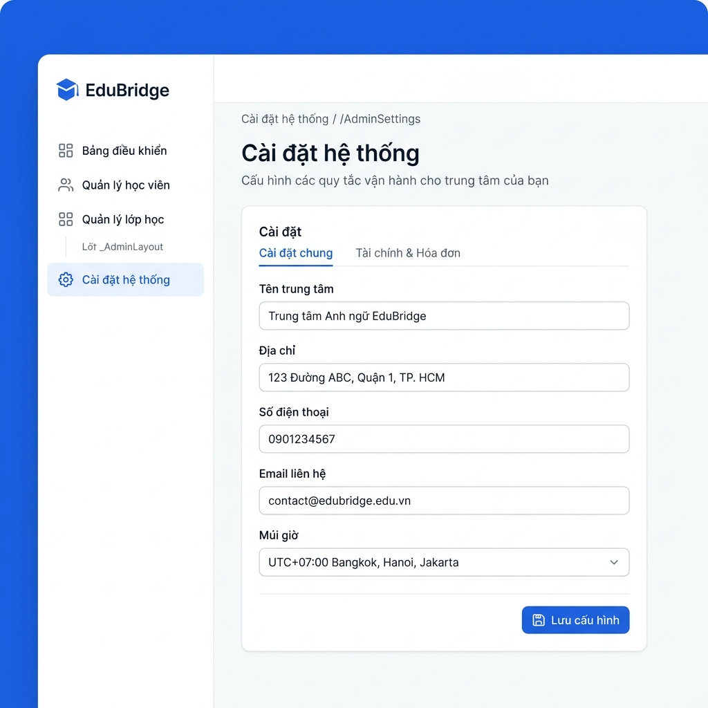

---

### 6.17 Teacher Dashboard (`/Teacher/Dashboard`)

**Razor Page:** [Dashboard.cshtml](file:///d:/Demo/EduBridge/EduBridge/Pages/Teacher/Dashboard.cshtml)

| Thuộc tính | Giá trị |
|---|---|
| **Layout** | `_TeacherLayout` |
| **Tiêu đề** | "Tổng quan" |

**Greeting:** "Xin chào, [Tên GV] 👋" — "Chúc bạn một ngày làm việc hiệu quả và tràn đầy năng lượng!"

**Stat Cards (4 thẻ):**

| # | Tên thẻ | Dữ liệu |
|---|---|---|
| 1 | Lớp đang phụ trách | Số lớp |
| 2 | Học sinh | Tổng HS các lớp |
| 3 | Bài tập cần chấm | Số bài chưa chấm |
| 4 | Lịch dạy hôm nay | Số buổi trong ngày |

**Sections:**

| # | Section | Nội dung |
|---|---|---|
| 1 | Lịch dạy hôm nay | Danh sách buổi: Tên lớp, Giờ, Phòng, Badge trạng thái (Sắp diễn ra / Đang diễn ra / Đã kết thúc), Nút điểm danh |
| 2 | Bài tập cần chấm | Danh sách: Tiêu đề, Lớp, Hạn nộp, Tỷ lệ đã chấm/đã nộp |
| 3 | Truy cập nhanh | 4 links: Điểm danh nhanh, Giao bài tập, Sổ điểm, Tin nhắn |
| 4 | Tin nhắn mới | Danh sách tin nhắn gần đây |


---

### 6.18 Quản lý bài giảng (`/Teacher/Lectures`)

**Razor Page:** [Lectures.cshtml](file:///d:/Demo/EduBridge/EduBridge/Pages/Teacher/Lectures.cshtml)

| Thuộc tính | Giá trị |
|---|---|
| **Layout** | `_TeacherLayout` |
| **Tiêu đề** | "Quản lý Lộ trình & Buổi học" |

**Stat Cards (3 thẻ):**

| # | Tên thẻ |
|---|---|
| 1 | Tổng số lớp |
| 2 | Trung bình tiến độ |
| 3 | Lớp hoàn thành |

**Bộ lọc:** `Lớp học` (dropdown), `Trạng thái lớp` (dropdown)

**Bảng dữ liệu:**

| Lớp học | Khóa học | Tiến độ | Buổi tiếp theo | Trạng thái | Thao tác |
|---|---|---|---|---|---|

- **Tiến độ**: Progress bar + phần trăm (%)
- **Thao tác**: `Cập nhật tiến độ` (mở modal)

**Modal Cập nhật tiến độ (`updateProgressModal`):**

| # | Trường | Loại |
|---|---|---|
| 1 | Buổi học hiện tại | Select/Number |
| 2 | Chủ đề/Bài học | Text |
| 3 | Bài tập về nhà | Textarea |
| 4 | Ghi chú | Textarea |
| 5 | Trạng thái | Select (Đang học / Tạm dừng / Hoàn thành) |

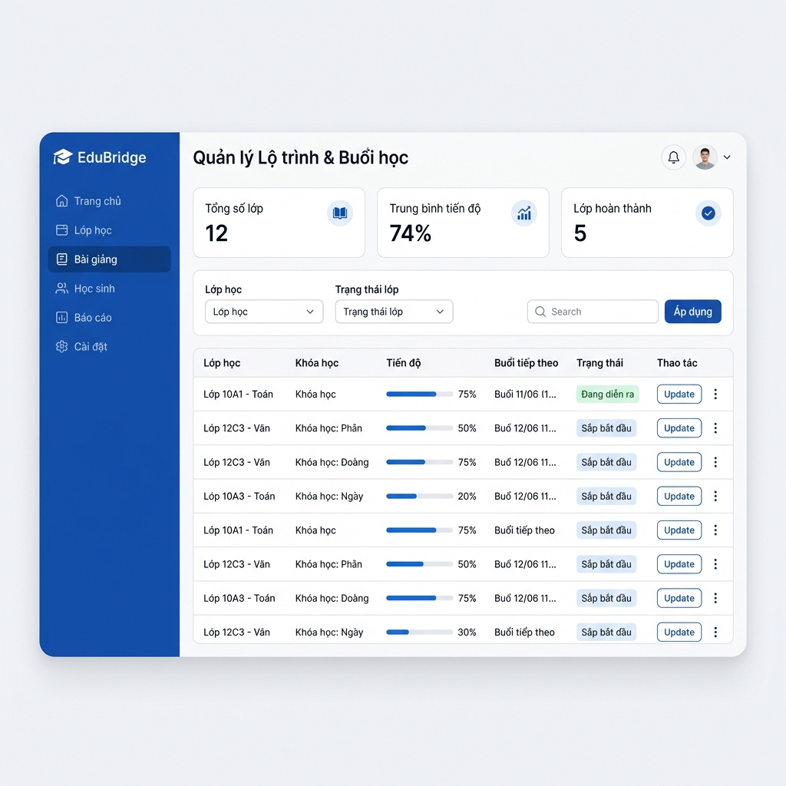

---

### 6.19 Quản lý điểm danh (`/Teacher/Attendance`)

**Razor Page:** [Attendance.cshtml](file:///d:/Demo/EduBridge/EduBridge/Pages/Teacher/Attendance.cshtml)

| Thuộc tính | Giá trị |
|---|---|
| **Layout** | `_TeacherLayout` |
| **Tiêu đề** | "Quản lý điểm danh" |

**Bộ lọc:**

| # | Tên filter | Loại |
|---|---|---|
| 1 | Chọn Lớp học | Dropdown |
| 2 | Chọn Buổi học | Dropdown (load theo lớp) |
| 3 | Lọc Học sinh | Text |
| 4 | Lọc Trạng thái | Dropdown (Có mặt, Vắng phép, Vắng không phép, Đi muộn, Về sớm) |

**Summary Cards (4 thẻ):**

| # | Tên thẻ |
|---|---|
| 1 | Sĩ số |
| 2 | Có mặt |
| 3 | Vắng mặt |
| 4 | Đi muộn/Về sớm |

**Bảng điểm danh:**

| Học sinh (Tên + Mã) | Có mặt | Vắng phép | Vắng K.Phép | Đi muộn | Về sớm | Ghi chú |
|---|---|---|---|---|---|---|

- Mỗi trạng thái là **Radio button**
- Ghi chú là **Text input**
- **Nút:** `Lưu điểm danh`

**Tab Lịch sử:**

| Ngày | Lớp | Buổi học | Có mặt | Vắng | Tỉ lệ | Thao tác |
|---|---|---|---|---|---|---|

- **Thao tác**: Xem/Sửa (mở modal `attendanceHistoryModal`)


---

### 6.20 Bài tập (`/Homework`)

**Razor Page:** [Homework.cshtml](file:///d:/Demo/EduBridge/EduBridge/Pages/Homework.cshtml)

| Thuộc tính | Giá trị |
|---|---|
| **Layout** | `_TeacherLayout` (GV) / `_Layout` (PH) |
| **Tiêu đề** | "Quản lý bài tập" (GV) / "Bài tập của con" (PH) |

#### Giao diện Giáo viên:

**Nút:** `+ Giao bài tập mới` (mở modal)

**Bộ lọc:** `Tìm tiêu đề bài tập`, `Lớp học` (dropdown), `Ngày tạo` (date), `Hạn nộp` (date)

**Bảng dữ liệu:**

| STT | Bài tập | Lớp | Đã nộp | Đã chấm | Ngày giao | Hạn nộp | Thao tác |
|---|---|---|---|---|---|---|---|

- **Đã nộp / Đã chấm**: Progress bar
- **Thao tác**: Xem/Chấm điểm (mở modal chi tiết)

**Modal Giao bài tập (`createHomeworkModal`):**

| # | Trường | Loại |
|---|---|---|
| 1 | Lớp học | Select |
| 2 | Buổi học | Select |
| 3 | Tiêu đề | Text |
| 4 | Mô tả | Textarea |
| 5 | Hạn nộp | Date Picker |
| 6 | File PDF | File Upload |

**Modal Chi tiết bài tập (`homeworkDetailModal`):**
Danh sách bài nộp của học sinh: Nội dung nộp, Trạng thái, Điểm, Nhận xét, Thao tác (Chấm điểm)

#### Giao diện Phụ huynh:
- Layout mobile-first, card-based
- Tabs theo từng con
- Mỗi card hiển thị: Tiêu đề bài tập, Badge trạng thái, Nút download PDF
- Modal `Nộp bài tập`

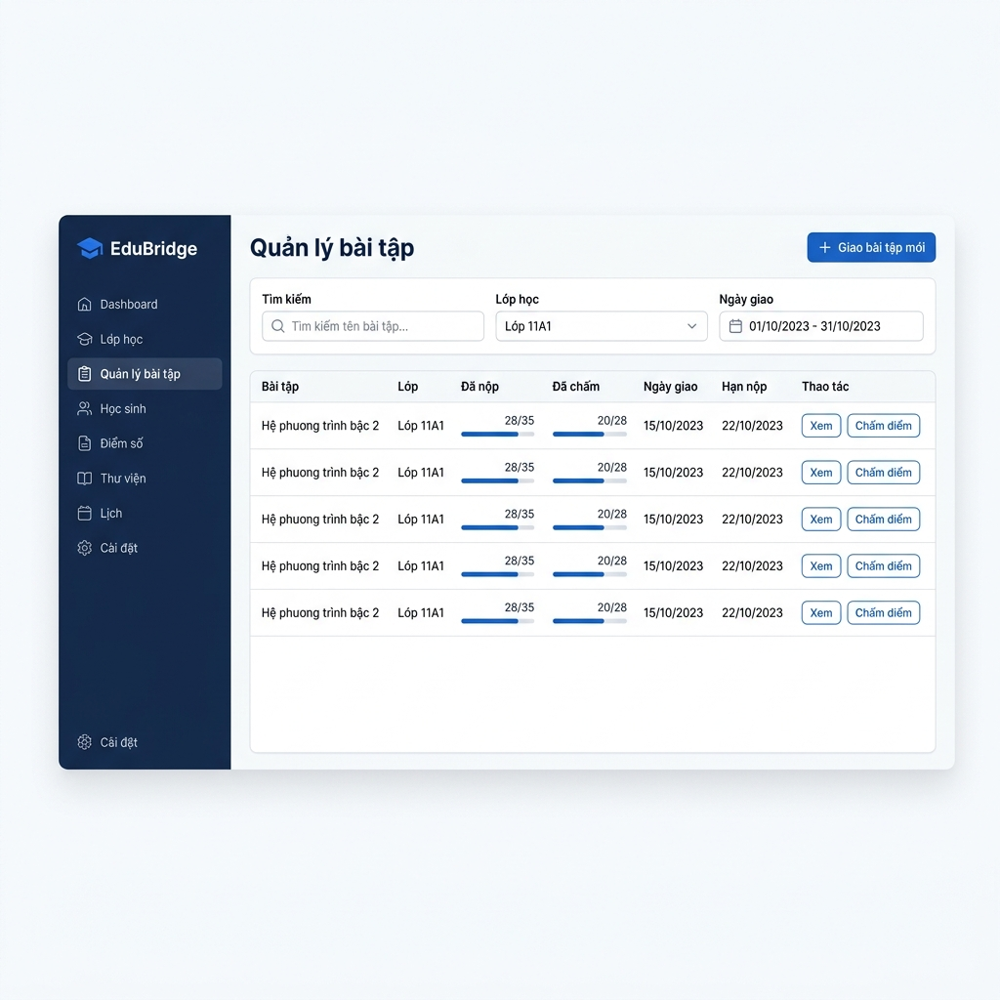

---

### 6.21 Sổ điểm (`/Grades`)

**Razor Page:** [Grades.cshtml](file:///d:/Demo/EduBridge/EduBridge/Pages/Grades.cshtml)

| Thuộc tính | Giá trị |
|---|---|
| **Layout** | `_TeacherLayout` |
| **Tiêu đề** | "Sổ điểm & Đánh giá" |

**Nút:** `+ Nhập điểm`

**Bộ lọc:** `Tìm tên học sinh` (text), `Lớp học` (dropdown)

**Bảng dữ liệu:**

| STT | Học sinh | KT 1 | KT 2 | Giữa kỳ | Cuối kỳ | TB | Thao tác |
|---|---|---|---|---|---|---|---|

- Điểm hiển thị với badge màu (xanh/xanh lam/vàng/đỏ tùy mức)
- **Thao tác**: Sửa (mở modal)

**Modal Nhập/Sửa điểm (`editGradeModal`):**

| # | Trường | Loại | Ghi chú |
|---|---|---|---|
| 1 | KT 1 | Number (0-10) | |
| 2 | KT 2 | Number (0-10) | |
| 3 | Giữa kỳ | Number (0-10) | |
| 4 | Cuối kỳ | Number (0-10) | |
| 5 | Nhận xét | Textarea | |

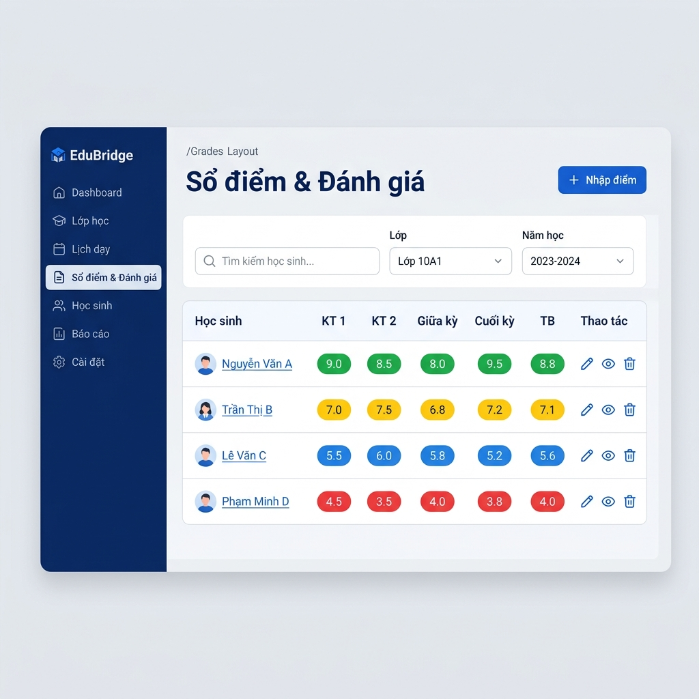

---

### 6.22 Tin nhắn (`/Messages`)

**Razor Page:** [Messages.cshtml](file:///d:/Demo/EduBridge/EduBridge/Pages/Messages.cshtml)

| Thuộc tính | Giá trị |
|---|---|
| **Layout** | `_TeacherLayout` / `_Layout` |
| **Tiêu đề** | "Tin nhắn" |
| **Real-time** | ✅ SignalR (ChatHub) |

**Nút (Giáo viên):** `Gửi thông báo chung` (mở `broadcastModal` — gửi tin nhắn cho cả lớp)

**Bộ lọc sidebar:**

| # | Filter | Loại |
|---|---|---|
| 1 | Tất cả các lớp | Dropdown |
| 2 | Tìm kiếm PH/GV | Text |
| 3 | Tìm kiếm HS | Text |

**Layout 2 cột:**
- **Cột trái:** Danh sách cuộc hội thoại (avatar, tên, tin nhắn cuối, thời gian, badge số tin chưa đọc)
- **Cột phải:** Khu vực chat
  - Header: Tên người chat, trạng thái
  - Tin nhắn: Bubble style (gửi/nhận phân biệt trái/phải)
  - Input: Đính kèm file, Ô nhập tin nhắn, Nút gửi

**SignalR Methods:**
- `SendMessage` — Gửi tin nhắn real-time
- `MarkAsRead` — Đánh dấu đã đọc
- Quy tắc chat: Parent ↔ Teacher (chỉ khi có HS đang học chung)

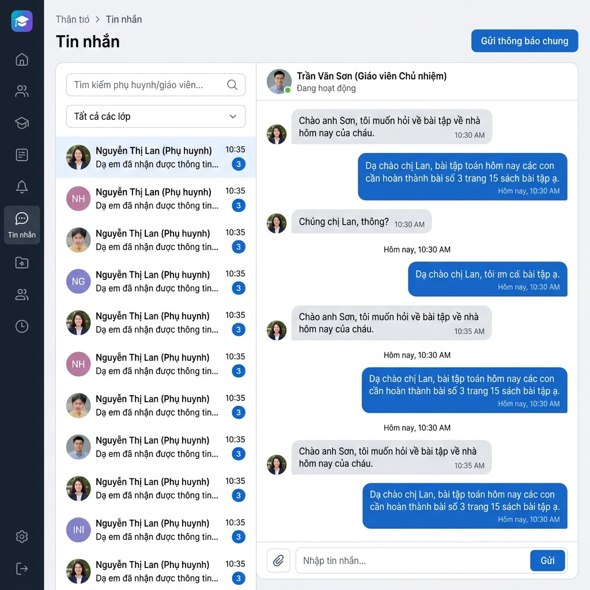

---

### 6.23 Hồ sơ cá nhân (`/Profile`)

**Razor Page:** [Profile.cshtml](file:///d:/Demo/EduBridge/EduBridge/Pages/Profile.cshtml)

| Thuộc tính | Giá trị |
|---|---|
| **Layout** | Dynamic (`_AdminLayout` / `_TeacherLayout`) |
| **Tiêu đề** | "Hồ sơ cá nhân" |

**Form:** Tương tự form Thêm/Sửa nhân sự nhưng:
- Không có trường Mã nhân sự
- Không có toggle Trạng thái
- Có banner Success/Error ở đầu form

**Section 1 — Thông tin cá nhân:** Avatar upload, Họ và tên, Giới tính, Ngày sinh, CCCD

**Section 2 — Thông tin liên hệ:** SĐT, Email, Địa chỉ

**Nút:** `Hủy` (history.back()), `Lưu`


---

### 6.24 Đổi mật khẩu (`/ChangePassword`)

**Razor Page:** [ChangePassword.cshtml](file:///d:/Demo/EduBridge/EduBridge/Pages/ChangePassword.cshtml)

| Thuộc tính | Giá trị |
|---|---|
| **Layout** | Dynamic |
| **Tiêu đề** | "Đổi mật khẩu" |

**Form (card centered, max-w-2xl):**

| # | Trường | Loại | Ghi chú |
|---|---|---|---|
| 1 | Mật khẩu hiện tại | Password | Có toggle 👁️ |
| 2 | Mật khẩu mới | Password | Có toggle 👁️ |
| 3 | Xác nhận mật khẩu mới | Password | Có toggle 👁️ |

**Nút:** `Hủy` (→ `/`), `Lưu`

---

### 6.25 Quản lý trung tâm (`/SystemAdmin/Centers`)

**Razor Page:** [Centers.cshtml](file:///d:/Demo/EduBridge/EduBridge/Pages/SystemAdmin/Centers.cshtml)

| Thuộc tính | Giá trị |
|---|---|
| **Layout** | `_AdminLayout` |
| **Tiêu đề** | "Quản lý Trung tâm" |

**Nút:** `+ Thêm mới` (→ `/SystemAdmin/CreateCenter`)

**Bộ lọc:** `Tên trung tâm` (text), `Email, SĐT` (text), `Ngày tạo` (date range), `Trạng thái` (dropdown)

**Bảng dữ liệu:**

| Mã | Logo | Tên Trung tâm | Email | SĐT | Ngày tạo | Chủ sở hữu | Trạng thái | Thao tác |
|---|---|---|---|---|---|---|---|---|

- **Trạng thái**: Toggle Active/Inactive
- **Thao tác**: `Hỗ trợ` (chuyển sang context trung tâm)

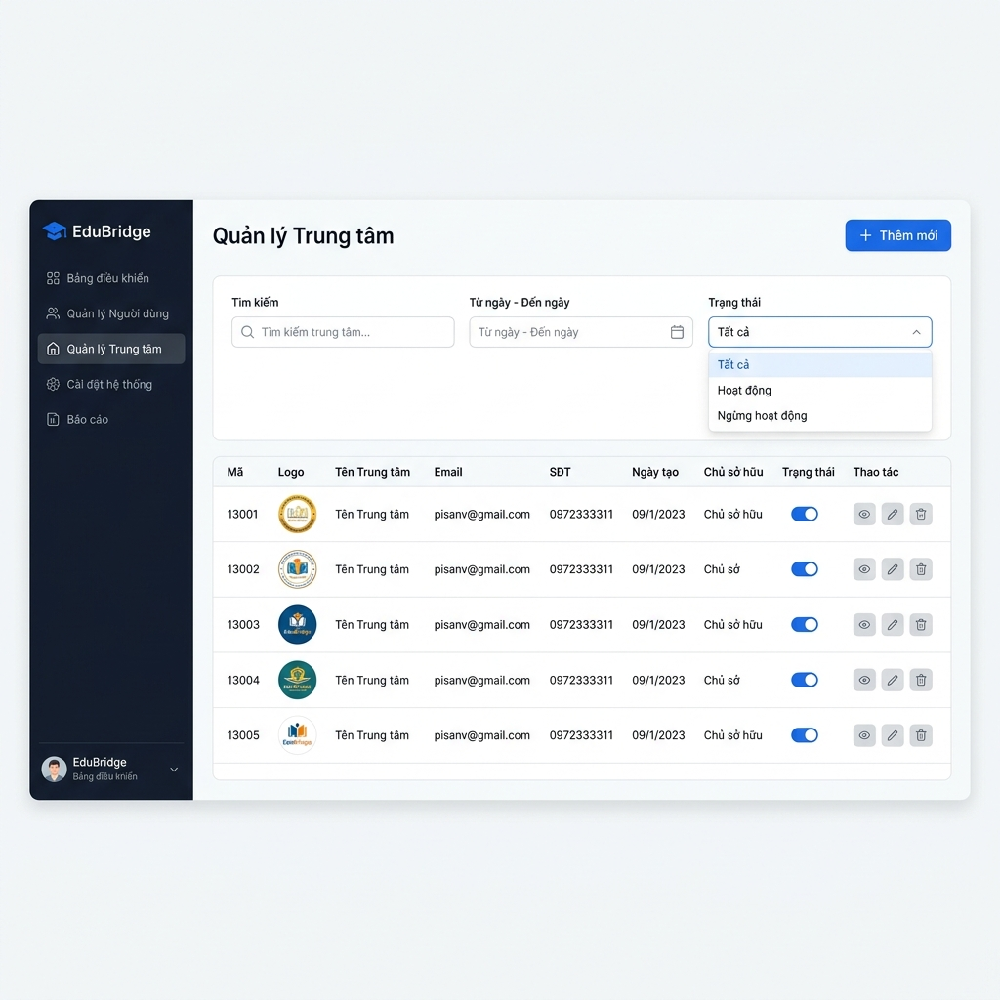

---

### 6.26 Thêm trung tâm (`/SystemAdmin/CreateCenter`)

**Razor Page:** [CreateCenter.cshtml](file:///d:/Demo/EduBridge/EduBridge/Pages/SystemAdmin/CreateCenter.cshtml)

**Form:**

| # | Trường | Loại |
|---|---|---|
| 1 | Logo trung tâm | File Upload |
| 2 | Mã trung tâm | Text |
| 3 | Tên trung tâm | Text |
| 4 | Số điện thoại | Text |
| 5 | Email | Text |
| 6 | Địa chỉ | Text |
| 7 | Trạng thái | Toggle |

---

### 6.27 Nhân sự hệ thống (`/SystemAdmin/Staffs`)

**Razor Page:** [Staffs/Index.cshtml](file:///d:/Demo/EduBridge/EduBridge/Pages/SystemAdmin/Staffs/Index.cshtml)

| Thuộc tính | Giá trị |
|---|---|
| **Layout** | `_AdminLayout` |
| **Tiêu đề** | "Quản lý nhân sự hệ thống" |

**Bộ lọc:** `Tìm tên, mã NV` (text), `Email, SĐT` (text), `Trạng thái` (Tất cả / Hoạt động / Đã khóa)

**Nút:** `+ Thêm nhân sự`, `Làm mới bộ lọc`, `Tìm kiếm`

**Bảng dữ liệu:**

| STT | ID | Nhân sự | Liên hệ | Ngày tạo | Trạng thái | Thao tác |
|---|---|---|---|---|---|---|

- **Nhân sự**: Avatar/Initials + FullName + StaffCode
- **Trạng thái**: Toggle inline
- **Thao tác**: Sửa, Xóa, Cấp lại MK

**Modals:** Reset mật khẩu (xác nhận → hiển thị MK tạm), Xóa nhân sự

**Phân trang:** Design System pagination + Page Size selector


---

### 6.28 Thêm / Sửa nhân sự hệ thống (`/SystemAdmin/Staffs/Create`, `/SystemAdmin/Staffs/Edit`)

Giao diện form tương tự [AdminStaff/Create](#613-thêm--sửa-nhân-sự-adminstaffcreate-adminstaffedit).

---

### 6.29 Nhật ký hệ thống (`/SystemAdmin/AuditLogs`)

**Razor Page:** [AuditLogs.cshtml](file:///d:/Demo/EduBridge/EduBridge/Pages/SystemAdmin/AuditLogs.cshtml)

| Thuộc tính | Giá trị |
|---|---|
| **Layout** | `_AdminLayout` |
| **Tiêu đề** | "Nhật ký Hệ thống" |

**Bộ lọc:** Tìm kiếm (text — Action, Target, Actor), Khoảng thời gian (Date Range Picker)

**Nút:** `Làm mới`, `Tìm kiếm`

**Bảng dữ liệu:**

| Thời gian | Hành động | Người thực hiện | Đối tượng | Trung tâm | Project |
|---|---|---|---|---|---|

- **Hành động**: Hiển thị dạng badge màu

**Phân trang:** Design System pagination + Page Size selector

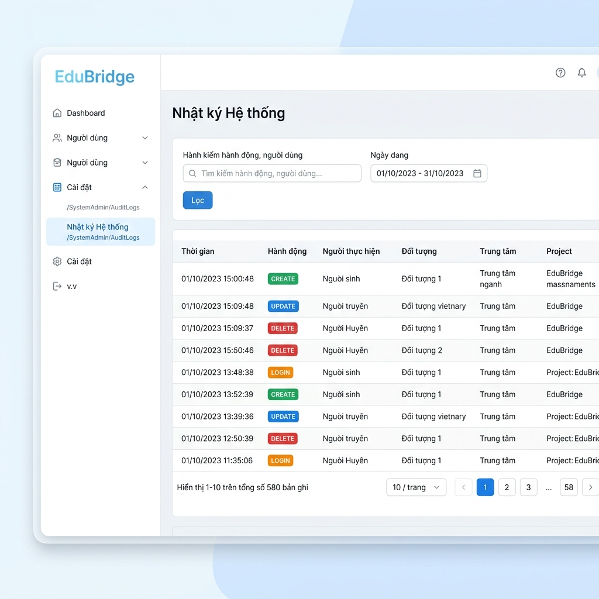

---

## 7. Luồng Tương Tác Người Dùng

### 7.1 Luồng đăng nhập & phân quyền

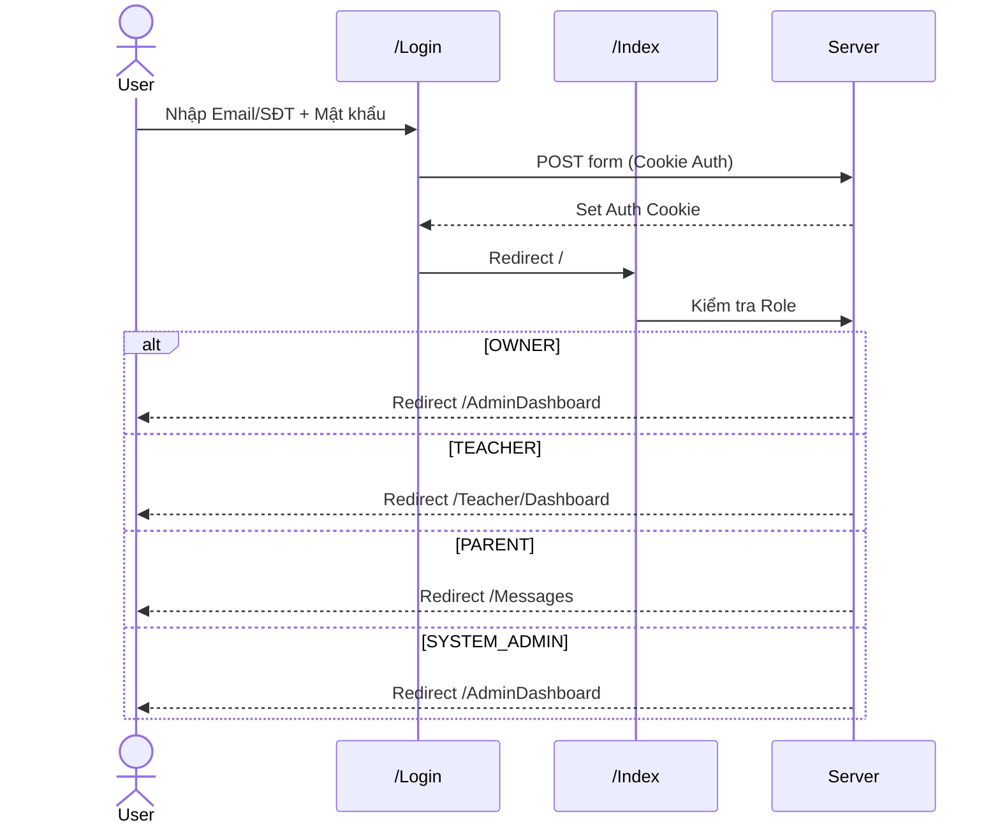
```mermaid
sequenceDiagram
    actor User
    participant Login as /Login
    participant Index as /Index
    participant System as Server

    User->>Login: Nhập Email/SĐT + Mật khẩu
    Login->>System: POST form (Cookie Auth)
    System-->>Login: Set Auth Cookie
    Login->>Index: Redirect /
    Index->>System: Kiểm tra Role
    alt OWNER
        System-->>User: Redirect /AdminDashboard
    else TEACHER
        System-->>User: Redirect /Teacher/Dashboard
    else PARENT
        System-->>User: Redirect /Messages
    else SYSTEM_ADMIN
        System-->>User: Redirect /AdminDashboard
    end
```

### 7.2 Luồng tạo lớp học

```mermaid
sequenceDiagram
    actor Admin
    participant List as /AdminClasses
    participant Create as /AdminClasses/Create
    participant DB as Database

    Admin->>List: Click "Thêm lớp mới"
    List->>Create: Navigate
    Admin->>Create: Điền form (Tên, Môn, GV, Phòng, Ngày KG)
    Admin->>Create: Thêm lịch học (Thứ + Ca)
    Note right of Create: JS tự tính Ngày kết thúc
    Admin->>Create: Click "Lưu lớp học"
    Create->>DB: POST → Tạo Class + ClassSchedules
    DB-->>List: Redirect về danh sách
```

### 7.3 Luồng ghi danh học viên

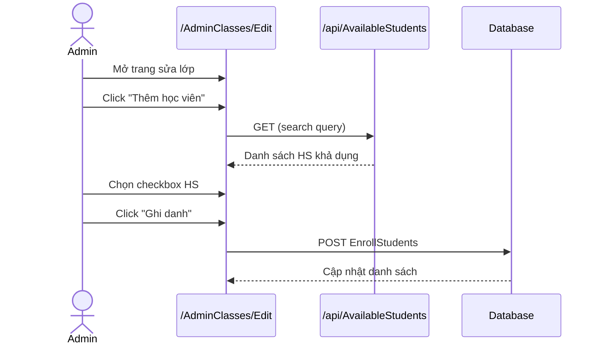
```mermaid
sequenceDiagram
    actor Admin
    participant Edit as /AdminClasses/Edit
    participant API as /api/AvailableStudents
    participant DB as Database

    Admin->>Edit: Mở trang sửa lớp
    Admin->>Edit: Click "Thêm học viên"
    Edit->>API: GET (search query)
    API-->>Edit: Danh sách HS khả dụng
    Admin->>Edit: Chọn checkbox HS
    Admin->>Edit: Click "Ghi danh"
    Edit->>DB: POST EnrollStudents
    DB-->>Edit: Cập nhật danh sách
```

### 7.4 Luồng thu học phí

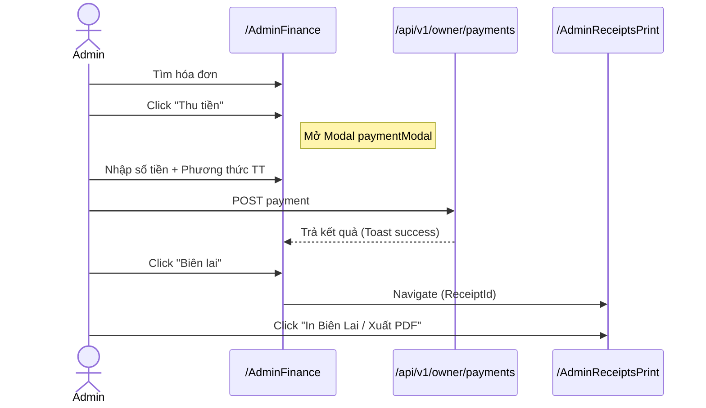
```mermaid
sequenceDiagram
    actor Admin
    participant Finance as /AdminFinance
    participant API as /api/v1/owner/payments
    participant Receipt as /AdminReceiptsPrint

    Admin->>Finance: Tìm hóa đơn
    Admin->>Finance: Click "Thu tiền"
    Note right of Finance: Mở Modal paymentModal
    Admin->>Finance: Nhập số tiền + Phương thức TT
    Admin->>API: POST payment
    API-->>Finance: Trả kết quả (Toast success)
    Admin->>Finance: Click "Biên lai"
    Finance->>Receipt: Navigate (ReceiptId)
    Admin->>Receipt: Click "In Biên Lai / Xuất PDF"
```

### 7.5 Luồng điểm danh

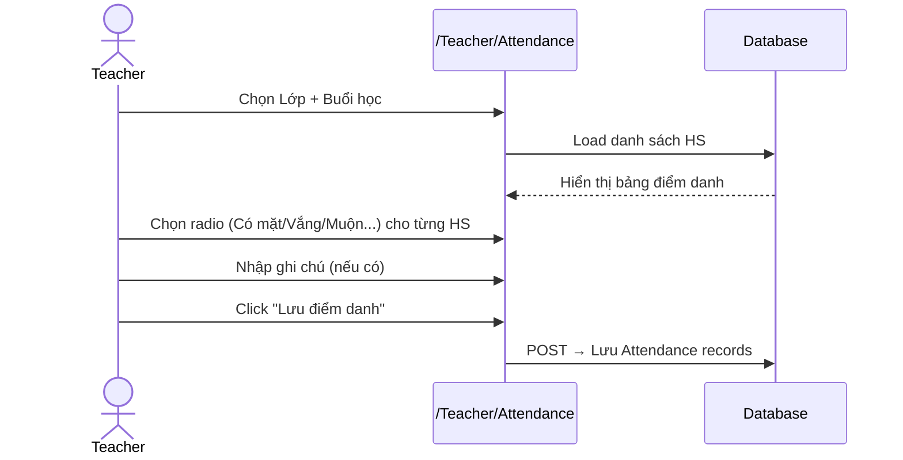
```mermaid
sequenceDiagram
    actor Teacher
    participant Att as /Teacher/Attendance
    participant DB as Database

    Teacher->>Att: Chọn Lớp + Buổi học
    Att->>DB: Load danh sách HS
    DB-->>Att: Hiển thị bảng điểm danh
    Teacher->>Att: Chọn radio (Có mặt/Vắng/Muộn...) cho từng HS
    Teacher->>Att: Nhập ghi chú (nếu có)
    Teacher->>Att: Click "Lưu điểm danh"
    Att->>DB: POST → Lưu Attendance records
```

### 7.6 Luồng nhắn tin (Real-time)

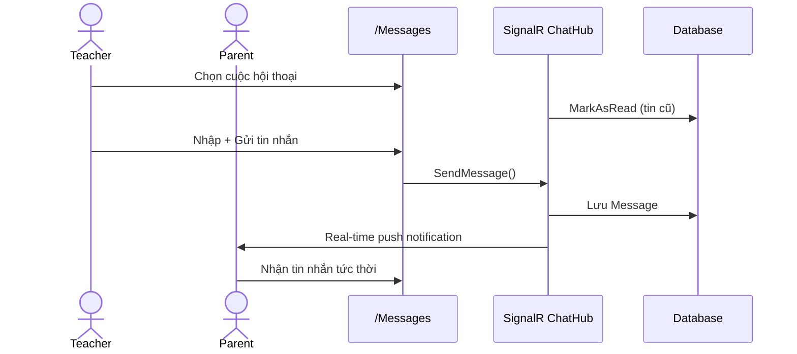
```mermaid
sequenceDiagram
    actor Teacher
    actor Parent
    participant Chat as /Messages
    participant Hub as SignalR ChatHub
    participant DB as Database

    Teacher->>Chat: Chọn cuộc hội thoại
    Hub->>DB: MarkAsRead (tin cũ)
    Teacher->>Chat: Nhập + Gửi tin nhắn
    Chat->>Hub: SendMessage()
    Hub->>DB: Lưu Message
    Hub->>Parent: Real-time push notification
    Parent->>Chat: Nhận tin nhắn tức thời
```

---

## 8. Thành Phần UI Dùng Chung

### 8.1 Design System & Bảng màu

**CSS Variables (theme.css):**

| Variable | Mô tả |
|---|---|
| `--background` | Màu nền chính |
| `--foreground` | Màu chữ chính |
| `--primary` | Màu chủ đạo (CTA buttons) |
| `--ds-surface` | Nền bề mặt (cards, modals) |
| `--ds-primary` | Màu primary design system |
| `--ds-border` | Màu viền |

**Màu chính:** Primary Blue `#1a73e8`, Success Green `#00b894`

**Dark Mode:** Hỗ trợ qua class `.dark` trên root element

### 8.2 Components tái sử dụng

| Component | Mô tả | Sử dụng tại |
|---|---|---|
| **Custom Date Picker** | Calendar popup hỗ trợ single date & date range, điều hướng ngày/tháng/năm | Tất cả form có trường ngày |
| **Searchable Dropdown** | Dropdown với ô tìm kiếm, hỗ trợ chọn đơn | AdminClasses/Create, filters |
| **Multi-select Dropdown** | Dropdown nhiều lựa chọn với search | AdminStaff form |
| **Toggle Switch** | CSS peer-based toggle Active/Inactive | Trạng thái entities |
| **Toast Notification** | Floating alert (success/error) | Toàn hệ thống |
| **Pagination** | Numbered `« ‹ 1 2 3 › »` + Page Size | Tất cả trang danh sách |
| **Confirm Modal** | Dialog xác nhận hành động (Xóa, Đóng, Reset MK) | Toàn hệ thống |
| **Avatar Upload** | Preview ảnh + Clear + Select file | Profile, Student/Staff forms |
| **Status Badge** | Badge màu theo trạng thái | Bảng dữ liệu |
| **Import/Export Excel** | Upload modal + History modal | Students, Parents, Staff |

### 8.3 JavaScript Modules

| File | Chức năng | Trang sử dụng |
|---|---|---|
| `site.js` | Custom Date Picker (init, calendar, state) | Global |
| `class-create.js` | Dynamic schedule rows, auto End Date calc | AdminClasses/Create, Edit |
| `class-enrollment.js` | Student search API, enroll/remove actions | AdminClasses/Edit |
| `parent-form.js` | Status toggle UI (Active/Inactive) | AdminParents/Create, Edit |
| `teacher-profile-form.js` | Avatar preview/clear, Multi-select dropdown | AdminStaff forms, Profile |

---

> [!NOTE]
> **Trang chưa implement:**
> - `/Dashboard` (Referenced in `_Layout` bottom nav cho Parent — chưa có Razor Page)
> - `/Progress` (Referenced in `_Layout` bottom nav cho Parent — chưa có Razor Page)
>
> **Tab ẩn trong source:**
> - Tab "Tài chính & Hóa đơn" trong AdminSettings (HTML bị comment out)

---

> **Tài liệu này được tạo tự động từ phân tích source code dự án EduBridge.**
> Mọi thông tin phản ánh đúng hiện trạng implementation tại thời điểm 20/07/2026.
